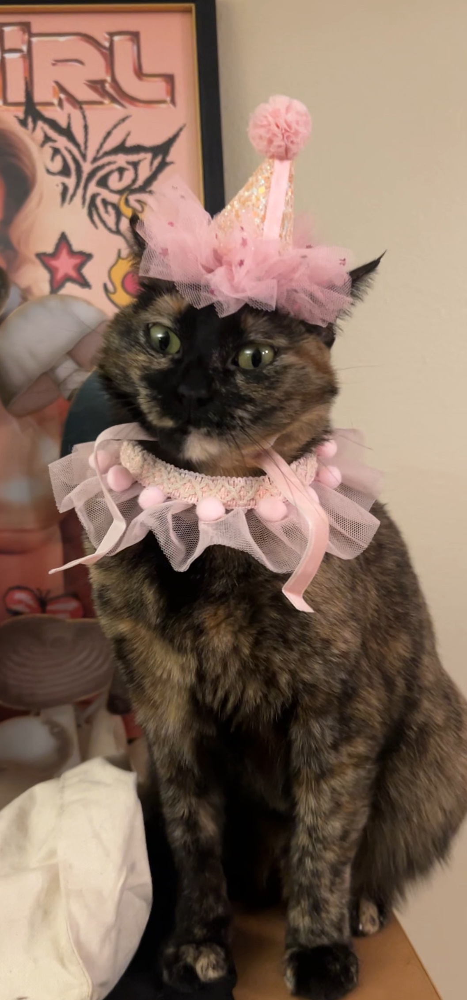
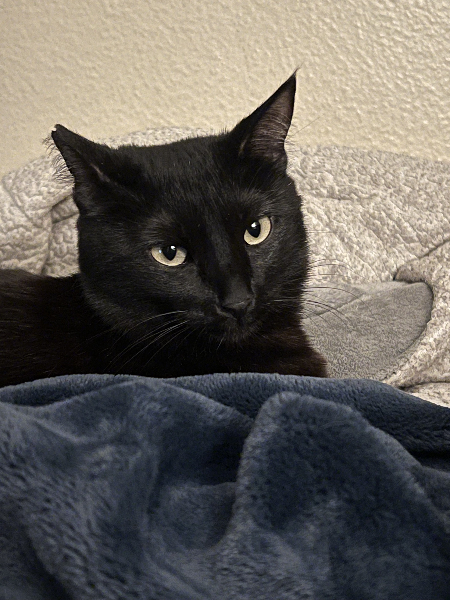

# :star: Hello! My Name is JayLynne Redeaux :star:

```python
def what_makes_a_good_programmer():
    quote = "A good programmer is someone who always looks both ways before crossing a one-way street."
    print(f"Hmm... What does it mean to be a good programmer?\n\nDoug Linder once said:\n\n\"{quote}\"\n")
    print("\nBut, why look both ways? What other qualities make a good programmer?")
    
what_makes_a_good_programmer()
``` 
## About Me:

1. I am a 3rd-year student at **UCSD**, majoring in **Computer Science** and **Cognitive Science**.
2. I was born and raised in **San Diego** and plan to stay local for my future career.
3. When I am not at school, I work as a **pet sitter**, but my favorite pets have to be my two girls, [Zora](#introducing-zora) and [Patch](#introducing-patch).
4. I recently binge-watched the Apple original series ["Silo"](https://en.wikipedia.org/wiki/Silo_(TV_series)) and now I have to wait a year for the next season 😞.
5. The coding languages that I know are:
   - **C**
   - **Python**
   - **Java**
   - **C++**
6. I'm currently taking **CSE 110** (_Software Engineering_) and **CSE 140/L** (_Component & Design of Technology/Digital Systems_).

---

### Meet My Pets!

#### Introducing Patch

**Patch** is a freshly 2-year-old tortie who falls in love with everyone she meets! She loves food (sometimes a little too much). She is the daughter of my older cat, [Zora](#introducing-zora). As long as she is with her person, she is the happiest girl. She will sit with you or nap anytime.

#### Nicknames:
- Babygirl
- Fatches
- Patches
- Fatty
- Chunky Monkey
- Patcheese

#### Favorite Activities:
- Eating
- Cuddling
- Sunbathing
- Napping
- Midnight Zoomies
- Annoying Zora
- Annoying me
- Making biscuits

---

#### Introducing Zora
 

**Zora** is roughly 4 years old and the absolute light of my life (don’t tell Patch). She is my first-ever cat that I have owned in my adult life. Adopting her truly unleashed my inner cat lady, and I have not been the same since. She loves getting attention and accepts hugs!

Fun fact about Zora: she does not want to be a mom and completely ignores her daughter, Patch! Zora does not like closed doors; she will meow and scratch until you let her in. She does not want to be left out for any reason!

#### Nicknames:
- Momma
- Zora Bora
- Stinky
- Zora Kitty
- Deadbeat

#### Favorite Activities:
- Napping
- Ignoring Patch
- Headbutting
- Meowing for food/attention
- Going places she should not be
- Door dashing

---

## Resources:
Check out some of my favorite websites and resources:
- [UCSD Cognitive Science Program](https://cogsci.ucsd.edu/)
- [Awesome Software Engineering Resources](https://github.com/Alliedium/awesome-software-engineering)
- [Silo (TV Series)](https://en.wikipedia.org/wiki/Silo_(TV_series))

---

## Section Links:
You can navigate to the sections directly below:
- [About Me](#about-me)
- [Meet My Pets](#meet-my-pets)
  - [Introducing Patch](#introducing-patch)
  - [Introducing Zora](#introducing-zora)

---

## Fun Facts About Me:
- I’m a huge fan of **science fiction** shows like **Silo**.
- I love playing with my cats, **Zora** and **Patch**, and I believe they secretly rule the house.
- I’m a self-proclaimed **cat whisperer** and can tell when my cats are plotting something mischievous.

---

## To-Do List (Task List):
- [x] Finish homework for **CSE 110**.
- [ ] Update GitHub with recent projects.
- [x] Watch more episodes of **Silo**.

